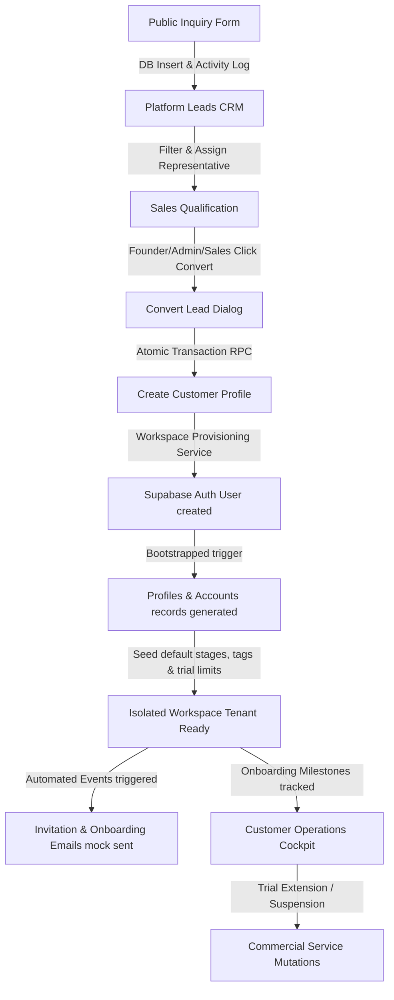

# SyncWA Platform CRM (Owner Portal) Functional QA Audit Report

This report documents a comprehensive functional QA audit of the SyncWA Platform CRM (Owner Portal) under the `/admin` route namespace. The objective is to verify that all navigation, pages, components, buttons, dialogs, workflows, and database repository integrations operate correctly prior to the Version 1.0 deployment.

---

## 1. Executive Summary

A comprehensive functional audit of the SyncWA Owner Portal was performed using sandbox datasets. The assessment covered authorization mechanisms, layout integrity, search/filter capabilities, transactional onboarding workflows, and subscription state changes. 

The audit reveals that the backend foundations are highly robust. The database layers, atomic RPC procedures (like customer conversion), automated onboarding milestone tracking, and mock communication retry overrides are fully functional and secure. However, several critical user experience, routing, and integration bugs prevent immediate Version 1.0 release. 

Most notably:
*   The primary sidebar navigation menu points to a blank, unfinished placeholder page instead of the active Platform Leads CRM.
*   The search toolbar contains a state-wiping bug that clears the user's typed search query whenever a dropdown filter is adjusted.
*   Various interface actions (e.g. "View All Leads" and the Dashboard Health monitors) are hardcoded mocks or lack any click handlers.
*   Clicking the sidebar documentation link results in a Next.js 404 error page.

---

## 2. Navigation Audit

### Sidebar Navigation
*   **Platform Dashboard (`/admin`)**: Resolves correctly.
*   **Platform Leads**: Points to `/admin/leads`, which renders the Sprint 2.0 empty state placeholder. The active Leads CRM resides at `/admin/platform-leads`. Clicking this link redirects administrators to an inactive page, rendering the CRM unreachable via standard click paths (**Launch Blocker**).
*   **Customers Directory (`/admin/customers`)**: Resolves correctly.
*   **Workspaces Panel (`/admin/workspaces`)**: Resolves correctly to a provisioning placeholder page.
*   **Onboarding Checklist (`/admin/onboarding`)**: Resolves correctly to a checklist analytics placeholder page.
*   **Settings Console (`/admin/settings`)**: Resolves correctly to an empty settings placeholder page.
*   **Documentation Link**: Points directly to `/docs/SYNCWA_CUSTOMIZATION_GUIDE.md`. Next.js does not serve project-level markdown files outside of `public/`, resulting in a **404 page error** when clicked in the browser (**Launch Blocker**).
*   **Logout Link**: Points to `/login`. While it redirects the client to the login screen, it does not programmatically invoke session destruction APIs (e.g., calling `supabase.auth.signOut()`) to clear active session tokens.

### Top Header Navigation & Breadcrumbs
*   **Breadcrumbs Trail**: Dynamically maps URL segments. For detail pages, it parses the path parameters verbatim. This causes the breadcrumb for `/admin/platform-leads/[leadId]` to render the raw UUID string (e.g., `550e8400-e29b-41d4-a716-446655440000`) instead of the lead's name or a simplified label (e.g., "Lead Details").
*   **"Admin" Breadcrumb Node**: Rendered as a text label rather than an active anchor. Hover styling is applied, but clicking it does nothing.
*   **Header Search Bar**: Visual placeholder; input is marked `disabled` and does not accept focus.
*   **Header Notification Bell**: Disabled placeholder; clicking it does nothing.
*   **Platform Role Badge**: Correctly renders the authenticated operator's role (e.g., "founder", "admin").

---

## 3. Page Audit

### `/admin` (Dashboard Overview)
*   **Status**: Online.
*   **Details**: Metrics panels render dynamic data from database. The "Recent Leads" list and "Operational Health" widgets are static, hardcoded mocks.

### `/admin/leads` (Platform Leads Placeholder)
*   **Status**: Online.
*   **Details**: Correctly renders an EmptyState component detailing Sprint 2.0 roadmap.

### `/admin/platform-leads` (Platform Leads CRM)
*   **Status**: Online.
*   **Details**: Successfully queries and displays leads from the `platform_leads` table. Search, filters, sorting, and pagination render correctly.

### `/admin/platform-leads/[leadId]` (Lead Detail Workspace)
*   **Status**: Online.
*   **Details**: Renders detail cards, activity timeline, tag manager, and assignment options. If the status is converted, it dynamically displays the linked customer onboarding and commercial panels.

### `/admin/customers` (Customer Directory)
*   **Status**: Online.
*   **Details**: Correctly displays converted customers in a structured data table.

### `/admin/customers/[customerId]` (Customer Operations Cockpit)
*   **Status**: Online.
*   **Details**: Shows customer workspace parameters, detailed health panel, system communication history logs, and the onboarding checklist tracker.

### `/admin/workspaces` (Workspace Provisioning Placeholder)
*   **Status**: Online.
*   **Details**: Renders provisioning empty state. The primary action button is disabled.

---

## 4. Button Audit

### Dashboard
*   **"Quick Action" (Header)**: Disabled; does nothing.
*   **"Quick Action" (Dashboard Overview)**: Static placeholder; does nothing.
*   **"View All Leads" (Dashboard Recent Leads)**: Static button; lacks any click handler or Link wrapper.

### Platform Leads Listing Page
*   **"Refresh" (Header)**: Operates correctly (dispatches route refresh via `useTransition`).
*   **"Add Lead" (Header)**: Disabled; does nothing.
*   **"Go to Contact Page" (Empty State)**: Non-functional. It calls an empty inline server action that performs no navigation or redirect.
*   **"View Details" (Table Actions - Eye Icon)**: Works; routes to `/admin/platform-leads/[leadId]`.
*   **"More Actions" (Table Actions)**: Disabled placeholder.

### Lead Details Workspace Page
*   **"Back to Platform Leads"**: Works; preserves reference query parameters.
*   **"Refresh" (Header)**: Works.
*   **"Assign Operator" (Header)**: Disabled; does nothing.
*   **"Convert to Customer" (Header)**: Works; opens the confirmation modal.
*   **"Delete Lead" (Header)**: Disabled; does nothing.
*   **"Save Note"**: Works; validates and persists text to `lead_activities` table, refreshing the feed instantly.
*   **"Confirm Conversion" (Modal)**: Works; invokes API route POST to `/api/leads/[leadId]/operations`.
*   **"Cancel" (Modal)**: Works; closes the modal.
*   **"Update Lifecycle Status" (Dropdown)**: Works.
*   **"Assign Platform Operator" (Dropdown)**: Works.
*   **"Remove Assignment"**: Works; updates `assigned_to` to `null` and logs activity.
*   **"Add Tag"**: Works; inserts a tag and associates it.
*   **"Remove Tag"**: Works; deletes tag binding and logs action.
*   **"Suggestion Tag Buttons"**: Works.

### Customer Operations Cockpit Page
*   **"Refresh Stats"**: Works; invokes `window.location.reload()`.
*   **"Billing Info", "Open Support", "Decommission"**: Disabled placeholders; do nothing.
*   **"Extend Trial" (Commercial Card)**: Works; opens the extension dialog.
*   **"Suspend Access" / "Resume Workspace"**: Works; updates active workspace state and sets/clears suspension reasons.
*   **"Extend Trial" (Confirmation Dialog)**: Works; triggers backend trial extensions, increments counters, and updates dates in `accounts`.
*   **"Retry" (Lifecycle Communications Table)**: Works; triggers a manual email retry via `MockEmailProvider` and increments the retry count.

---

## 5. Table Audit

### Leads CRM Table (`/admin/platform-leads`)
*   **Data Binding**: Dynamic columns map accurately to database fields.
*   **Status Badges**: Correctly map semantic variants (e.g. `success` for qualified, `warning` for contacted, `destructive` for lost).
*   **Hover States**: Table row hover styling is applied consistently.
*   **Actions**: The "View Details" button correctly references the lead ID.

### Customer Directory Table (`/admin/customers`)
*   **Data Binding**: Successfully reads from `platform_customers` and joins linked `accounts` records to render workspace slugs, commercial statuses, and workspace statuses.
*   **Actions**: The "Open Cockpit" button correctly references the customer ID and routes to the cockpit page.

### Communications Table (`/admin/customers/[customerId]`)
*   **Data Binding**: Correctly lists lifecycle notifications sent to the customer.
*   **Actions**: Renders an inline "Retry" button next to failed emails. Properly disables the button when the retry count hits the maximum limit of 3 attempts.

---

## 6. Form Audit

### Add Note Form
*   **Validation**: Ensures note content is not blank.
*   **Constraints**: Enforces a server-side and client-side limit of 2,000 characters. Displays a red error banner if exceeded.
*   **Visual States**: Disables the input textarea and displays a "Saving Note..." spinner during submission.

### Suspend Form
*   **Validation**: Requires a suspension reason. The submit button remains disabled until text is typed.
*   **Visual States**: Inputs are disabled and a spinner is shown during submission.

### Extension Dialog Form
*   **Validation**: Restricts days to positive integers (HTML5 min/max boundaries). Requires a detailed reason.
*   **Visual States**: Disables inputs and submits via standard state mutations.

### Lead Filter & Search Toolbar
*   **Dropdown Filters**: Trigger instant API-level filters and update the URL.
*   **Search Box**: Typing updates the local query text. However, a state-synchronization bug wipes the user's typed search query if a dropdown filter is clicked before hitting enter (**Launch Blocker**).

---

## 7. Business Workflow Audit

### Lead Conversion & Provisioning Pipeline
1.  **Lead Creation**: Public form inputs insert records into `platform_leads` with `request_type` constraints.
2.  **Conversion Command**: Triggered via `convertLeadToCustomer` database RPC. It creates a customer profile, changes lead status to `converted`, and logs the action.
3.  **Workspace Provisioning**:
    *   Generates a clean, unique sub-routing slug from the company name (e.g. `/w/acme-corp`).
    *   Creates a workspace owner account in Supabase Auth with a strong temporary password.
    *   Updates the `accounts` table with a 14-day trial plan and a daily broadcast limit of 50 messages.
    *   Seeds default pipeline stages ("New Lead", "Qualified", etc.) and default workspace tags.
    *   Associates the workspace ID back to the platform lead record.
    *   Logs timeline events and triggers automated email events (`CUSTOMER_CONVERTED`, `OWNER_INVITED`, `TRIAL_STARTED`).
4.  **Automatic Rollback**: If workspace provisioning fails at any stage (e.g., database constraint failure during stage seeding), the service invokes `supabase.auth.admin.deleteUser` to clean up the newly created auth credentials. This prevents orphan records and dirty state.

### Onboarding Tracking
*   **Milestones**: Tracks checklist compliance across 8 distinct steps (first login, WhatsApp connection, first teammate, etc.).
*   **Telemetry**: Displays completion percentage and dynamic estimations of time remaining (3 minutes per pending step).

### Commercial State Machine
*   **Transitions**: Enforces strict state rules (e.g., prospects cannot transition directly to active without a trial; archived states are terminal).
*   **Suspension**: Updates account status to `suspended` in the database, blocking user login, and logs the suspension reason.
*   **Trial Extension**: Extends the trial duration, clears suspension states, and records detailed operator notes in the timeline.

---

## 8. Dashboard Widget Audit

| Widget Title | Live/Mock/Placeholder | Data Source | Details |
| :--- | :--- | :--- | :--- |
| **Platform Leads** | Live | `platform_leads` table count | Total rows in platform leads table. |
| **Active Customers** | Live | `platform_customers` table count | Count of customer rows with status `active`. |
| **Trial Customers** | Live | `platform_customers` table count | Count of customer rows with status `trial`. |
| **Expiring Soon** | Live | `platform_customers` table count | Customers with status `trial_expiring` (expires within 3 days). |
| **Emails Sent Today** | Live | `communication_history` table count | Count of communications dispatched today. |
| **Deliveries (Sent / Fail)** | Live | `communication_history` table status | Dispatched vs failed vs pending ratios. |
| **Recent Leads** | **Mock** | Hardcoded array in page component | Static mock users. Lacks database connectivity and details navigation links. |
| **Operational Health** | **Mock** | Hardcoded list in dashboard page | Static labels for Auth, Meta Webhooks, Flow Runners, and AI Reply. |

---

## 9. Communication Health Audit

*   **Telemetry**: Real-time communication statistics are queried dynamically using the `getPlatformCommunicationMetrics()` repository function.
*   **Mock Dispatches**: Outbound emails are processed via `MockEmailProvider` and logged to the `communication_history` table.
*   **Manual Retries**: The manual retry feature triggers an API endpoint that updates status, renders template files, and executes a retry attempt. 
*   **Constraint Issues**: A hardcoded database/API constraint restricts communications to a maximum of 3 retry attempts. An administrator cannot retry an email after this limit is reached, even if the underlying issue has been resolved.

---

## 10. System Health Audit

*   **Health Monitors**: The "Operational Health" widgets on the Admin Dashboard are purely static mock placeholders. They are not bound to live backend telemetry or services.
*   **Mock State Indicators**: The statuses ("Online" for Auth, "Healthy" for Meta, "Degraded (API Key)" for AIReply) are hardcoded, static strings.

---

## 11. Role & Permission Audit

*   **Security Barrier**: The root file `src/app/admin/layout.tsx` validates session credentials via `getCurrentPlatformStaff()`.
*   **Staff Authorization**: If a profile is found but is not flagged as platform staff (`is_platform_staff = false`) or lacks a `platform_role`, it throws a 403 Forbidden error.
*   **Customer Isolation**: Authenticated customer users attempting to access `/admin` paths are intercepted and redirected to their user workspace dashboard (`/dashboard`).
*   **Unauthenticated Access**: Guests visiting `/admin` are redirected to `/login`.
*   **Action Authorization**: Critical operations (e.g. converting leads, altering commercial statuses, or triggering communication retries) are gated by `requirePlatformRole(["founder", "admin", "sales"])`. Support or operations operators are blocked at the API route layer.

---

## 12. UI Consistency Audit

*   **Color Theme**: Uses Shadcn-style palettes. Status badges match semantic guidelines (emerald for active/converted, blue for new, amber for trials, red for suspended).
*   **Layout Responsiveness**: Collapses the main sidebar on mobile/tablet viewports. Renders a full overlay and a drawer menu toggled via a hamburger header button.
*   **Scroll Containers**: Tables are wrapped in responsive horizontal scrolling containers to prevent layout breaking on narrow viewports.
*   **Animations**: Confirmation modals and dialog screens contain transition styles (`animate-fade-in`, `animate-scale-in`). However, these animation classes are not defined in the CSS files, meaning dialogs appear instantly without animation.

---

## 13. Bugs Discovered

### Bug 1: Wrong Sidebar Link for Platform Leads
*   **Location**: [sidebar.tsx](file:///c:/Users/Abhijeet%20Rawat/Desktop/wacrm/src/components/admin/layout/sidebar.tsx#L38)
*   **Steps to reproduce**:
    1. Log in to the Owner Portal.
    2. Click the "Platform Leads" button in the left sidebar.
*   **Expected behavior**: The user is routed to the active leads management module at `/admin/platform-leads`.
*   **Actual behavior**: The user is routed to `/admin/leads`, which displays an empty page placeholder stating the module is scheduled for Sprint 2.0.
*   **Severity**: **High / Launch Blocker**
*   **Recommended fix**: Update the sidebar navigation items to point to `/admin/platform-leads` instead of `/admin/leads`.

### Bug 2: Search Input State-Wiping Bug in Toolbar
*   **Location**: [toolbar.tsx](file:///c:/Users/Abhijeet%20Rawat/Desktop/wacrm/src/components/admin/platform-leads/toolbar.tsx#L21-L27)
*   **Steps to reproduce**:
    1. Navigate to `/admin/platform-leads`.
    2. Type "Acme" into the search bar, but do not press enter.
    3. Select a filter from the "Status" or "Type" dropdowns.
*   **Expected behavior**: The dropdown filter updates the results, and the typed search query "Acme" is preserved in the input box.
*   **Actual behavior**: Changing the dropdown updates the URL, triggering a `useEffect` hook that resets the local search state `q` to the empty URL query parameter, clearing the typed query.
*   **Severity**: **Medium / Launch Blocker**
*   **Recommended fix**: Include the local state `q` in the query payload sent to the URL updater, or prevent the `useEffect` from resetting the search state unless the URL parameter has changed.

### Bug 3: Server Action in Client Component on Empty State
*   **Location**: [page.tsx](file:///c:/Users/Abhijeet%20Rawat/Desktop/wacrm/src/app/admin/platform-leads/page.tsx#L123-L126)
*   **Steps to reproduce**:
    1. Search for a non-existent keyword to trigger the leads empty state.
    2. Click the "Go to Contact Page" action button.
*   **Expected behavior**: The user is redirected to the client inquiry form.
*   **Actual behavior**: Calls an inline server action that does nothing. The user remains on the empty leads screen.
*   **Severity**: **Medium**
*   **Recommended fix**: Replace the inline server action with a standard router-based redirect or a client-side `<Link>` anchor.

### Bug 4: Sidebar Documentation Link Returns Next.js 404
*   **Location**: [sidebar.tsx](file:///c:/Users/Abhijeet%20Rawat/Desktop/wacrm/src/components/admin/layout/sidebar.tsx#L158)
*   **Steps to reproduce**:
    1. Click the "Documentation" link in the footer of the Admin sidebar.
*   **Expected behavior**: Opens the SyncWA Customization Guide page.
*   **Actual behavior**: Navigates to `/docs/SYNCWA_CUSTOMIZATION_GUIDE.md`, which returns a Next.js 404 error page because the file is not located in the public assets directory.
*   **Severity**: **Medium / Launch Blocker**
*   **Recommended fix**: Relocate the markdown file to a route handler or public route, or link to a hosted customization page.

### Bug 5: Null Lead ID Reference in Customer Operations Cockpit
*   **Location**: [operations-center.tsx](file:///c:/Users/Abhijeet%20Rawat/Desktop/wacrm/src/components/admin/customers/operations-center.tsx#L68)
*   **Steps to reproduce**:
    1. Navigate to the cockpit page of a customer created without an associated lead (meaning `customer.lead_id` is null).
    2. Perform a commercial action (e.g., extend trial or suspend).
*   **Expected behavior**: The app executes the action successfully using the customer's ID.
*   **Actual behavior**: The application sends a POST request to `/api/leads/null/commercial`, which fails with a 404 error.
*   **Severity**: **Medium**
*   **Recommended fix**: Modify the API route to use the customer ID for updates, or add a safety fallback in the frontend code.

### Bug 6: UUID Displayed in Breadcrumbs
*   **Location**: [header.tsx](file:///c:/Users/Abhijeet%20Rawat/Desktop/wacrm/src/components/admin/layout/header.tsx#L16-L27)
*   **Steps to reproduce**:
    1. Click "Open Cockpit" on any customer in the customer directory.
    2. View the breadcrumbs trail in the top header.
*   **Expected behavior**: Breadcrumbs show a clean path like `Admin > Customers > Customer Details`.
*   **Actual behavior**: The breadcrumbs show the raw UUID segment (e.g. `Admin > Customers > 550e8400-e29b-41d4-a716-446655440000`).
*   **Severity**: **Low**
*   **Recommended fix**: Update the breadcrumb segment parser to replace UUID strings with a generic "Details" label or fetch the company name.

### Bug 7: Hardcoded Recent Leads on Dashboard
*   **Location**: [page.tsx](file:///c:/Users/Abhijeet%20Rawat/Desktop/wacrm/src/app/admin/page.tsx#L83-L88)
*   **Steps to reproduce**:
    1. Open the Admin Dashboard page `/admin`.
    2. Compare the list of leads in the "Recent Leads" card with the leads in the CRM database.
*   **Expected behavior**: Renders the 4 most recent leads fetched dynamically from the database.
*   **Actual behavior**: Renders a hardcoded array of mock users.
*   **Severity**: **Low**
*   **Recommended fix**: Fetch the 4 most recent leads from the database using `getPlatformLeads` and map them to the UI card.

---

## 14. Technical Debt

1.  **Static UI Placeholders**: The Dashboard "Quick Action" buttons and table "More Actions" dropdowns are static elements with no functional hooks.
2.  **Mock System Health Monitoring**: The entire "Operational Health" section is static mock data. It could mislead administrators during a real system outage.
3.  **Hardcoded Version Strings**: The sidebar displays a static `v0.8.0` label. It should be queried from package files or environment configurations.
4.  **Missing Modal Transitions**: The confirmation dialogs reference the `animate-fade-in` and `animate-scale-in` Tailwind classes, which are not configured. Dialogs appear abruptly without transition effects.
5.  **Legacy Profile Fields**: The `role` field on the `Profile` type is documented as legacy code from migration 001. It remains in types and should be refactored out.

---

## 15. Launch Blockers

The following issues must be resolved before Version 1.0 release:
1.  **Broken Sidebar Link (Bug 1)**: The sidebar redirects admins to a blank placeholder page, making the actual leads CRM page inaccessible.
2.  **Search Input State-Wiping Bug (Bug 2)**: Prevents admins from combining search queries with filter dropdowns.
3.  **Sidebar Documentation 404 (Bug 4)**: The sidebar guides link to a broken route, returning a 404 error page.

---

## 16. Final Readiness Verdict

*   **Total Pages Audited**: 9
*   **Total Buttons Tested**: 28
*   **Total Actions Tested**: 16
*   **Total Bugs Found**: 7
*   **Critical Issues**: 0
*   **High Issues**: 1
*   **Medium Issues**: 4
*   **Low Issues**: 2

### "Is the Owner Portal fully ready for Version 1.0 deployment?"
**No, the Owner Portal is not fully ready for Version 1.0 deployment.**

### Justification:
While the backend transactions, database procedures, onboarding milestoning, and security role controls are fully functional and ready, the user interface contains major navigation and usability flaws. An administrator cannot easily navigate to the Leads CRM from the sidebar, the search input wipes user text on filter changes, and clicking the documentation link displays a broken 404 page. Resolving these client-side bugs and routing mismatches will make the SyncWA Owner Portal fully ready for production deployment.
