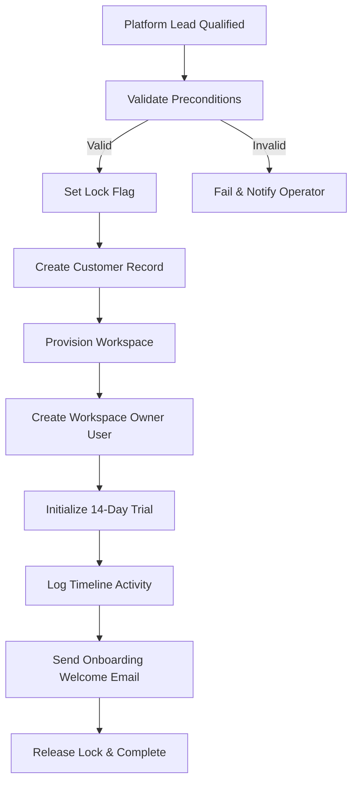

# Product Requirements Document (PRD): Customer Conversion & Onboarding

**Version:** 1.1  
**Status:** Approved (Source of Truth - Locked)  
**Author:** Antigravity (AI Product Strategy Agent)  
**Date:** 2026-08-04  
**Workspace:** `c:\Users\Abhijeet Rawat\Desktop\wacrm`  

---

## Table of Contents
1. [Purpose](#1-purpose)
2. [Scope](#2-scope)
3. [Business Goals](#3-business-goals)
4. [Customer Business Entity](#4-customer-business-entity)
5. [Customer Status Lifecycle](#5-customer-status-lifecycle)
6. [Conversion Preconditions](#6-conversion-preconditions)
7. [Customer Conversion Flow](#7-customer-conversion-flow)
8. [Conversion State Machine](#8-conversion-state-machine)
9. [Data Mapping](#9-data-mapping)
10. [Business Rules](#10-business-rules)
11. [Transaction Rules & Visibility](#11-transaction-rules--visibility)
12. [Workspace Provisioning](#12-workspace-provisioning)
13. [Workspace Naming Rules](#13-workspace-naming-rules)
14. [Workspace Owner](#14-workspace-owner)
15. [Trial Lifecycle](#15-trial-lifecycle)
16. [Customer Onboarding Stages](#16-customer-onboarding-stages)
17. [Customer Communication](#17-customer-communication)
18. [Timeline Activities](#18-timeline-activities)
19. [Retry & Recovery Strategy](#19-retry--recovery-strategy)
20. [Security & Data Privacy](#20-security--data-privacy)
21. [Audit & Notification Requirements](#21-audit--notification-requirements)
22. [Success Metrics](#22-success-metrics)
23. [Future Expansion](#23-future-expansion)
24. [Acceptance Criteria](#24-acceptance-criteria)
25. [Operational Business Rules Summary](#25-operational-business-rules-summary)

---

## 1. Purpose

This Product Requirements Document (PRD) establishes the business specifications for converting a qualified **Platform Lead** into an active **Customer** with a provisioned **Workspace**.

It acts as the functional contract connecting:
- **SyncWA Website Strategy Document (SWSD)** (Marketing & Acquisition)
- **SyncWA Data & Domain Model (SDDM)** (Business domains and entities relationship blueprint)
- **SyncWA Platform CRM Design System (PCDS)** (User interaction guidelines)
- **SyncWA Engineering Standards** (Software architecture guidelines)

This specification governs all functional designs for Sprint 3.

---

## 2. Scope

### 2.1 Included (In Scope)
- **Customer Conversion**: Creating a new Customer record from an approved Platform Lead.
- **Workspace Provisioning**: Provisioning a tenant Workspace instance associated with the Customer.
- **Workspace Owner Creation**: Generating the initial administrator user profile for the tenant Workspace.
- **Trial Initialization**: Setting up the trial parameters (validity, limits) on the provisioned workspace.
- **Welcome Communication**: Auto-triggering onboarding emails containing workspace connection keys.
- **Timeline Logging**: Emitting tracking records to the Platform CRM Activity Center.

### 2.2 Excluded (Out of Scope)
- **Billing & Subscriptions**: Managing invoices, processing credit cards, or handling automated plan downgrades (scheduled for Sprint 4).
- **Add-on Marketplace**: Selling additional WhatsApp phone numbers or operator licenses.
- **WhatsApp API Numbers Approval**: Regulatory verification of WhatsApp numbers.
- **Support Ticketing System**: Operational ticket desks (handled under CRM Support modules).

---

## 3. Business Goals

- **Reduce Onboarding Time**: Automate manual setups, reducing workspace provisioning times to under 10 seconds.
- **Minimize Manual Platform Work**: Eliminate human errors by replacing manual table inputs with programmatic operations.
- **Consistent Onboarding Experience**: Standardize default databases, channels, pipelines, and templates.
- **Workspace Isolation**: Enforce absolute data isolation between tenant workspaces.
- **SaaS Scalability**: Lay down micro-tenant provisioning pipelines to scale from 10 to 10,000+ active customers.

---

## 4. Customer Business Entity

A **Customer** represents the commercial relationship between SyncWA and an organization:
- **Commercial Relationship**: It encapsulates billing agreements, overall subscription plans, corporate billing information, and contractual bounds.
- **Operational Workspace**: A **Workspace** represents the isolated operational environment owned by that Customer where daily WhatsApp communications occur.
- **MVP Boundary constraint**: For the initial MVP, the relationship is strictly **One Customer to One Workspace**.
- **Future Scale**: The database and architecture must be designed to support **One Customer to Multiple Workspaces** (e.g. enterprise organizations hosting separate brand workspaces under a single billing contract).

*Note: All business terminology (Customer, Workspace, Owner) remains conceptual and independent from physical database table representations (`accounts`, `profiles`).*

---

## 5. Customer Status Lifecycle

The Customer entity moves through the following business lifecycle states:
- **PENDING_APPROVAL**: Customer completed onboarding/payment requirements. Waiting for Founder approval.
- **TRIAL**: Trial is active. Workspace usable.
- **ACTIVE**: Paid customer. Normal operation.
- **PAUSED**: Temporary access restriction (e.g. payment overdue, customer request). Can be reactivated.
- **SUSPENDED**: Administrative suspension (e.g. compliance/security review). Requires manual review before reactivation.
- **CANCELLED**: Customer voluntarily terminated service. No active subscription.
- **BLOCKED**: Permanent administrative block (e.g. fraud, abuse). Cannot be reactivated through normal UI.
- **ARCHIVED**: Historical record. Workspace retained for auditing.

> [!IMPORTANT]
> The **Customer Status** is completely independent of:
> 1. **Lead Status** (e.g. `converted`, `lost` which belong to CRM acquisition logs).
> 2. **Workspace Status** (e.g. `active`, `maintenance`).
> 3. **Subscription Status** (e.g. `trialing`, `active`, `past_due`, `unpaid`).
> 4. **Onboarding Status** (progressing from `invitation_sent` to `completed` independently).

---

## 6. Conversion Preconditions

Before a Platform Lead can be converted to an active Customer, the system must validate the following preconditions:
1. **Lead Eligibility check**: The lead status must be `qualified` or `demo_completed`.
2. **Information Completion check**: Email, full name, company name, and company size must be present.
3. **Email Verification**: Enforce email format verification.
4. **Workspace Name check**: The company name must translate to a valid, clean URL-slug that does not conflict with existing workspaces.
5. **No Existing Customer**: The target email must not be associated with another active Customer or Workspace in the system.
6. **No Concurrent Conversions**: A lock flag must be asserted during processing to block duplicate conversion requests if the operator clicks the "Convert" button multiple times.
7. **Operator Confirmation**: The administrative operator must review parameters and explicitly confirm the action.

---

## 7. Customer Conversion Flow



---

## 8. Conversion State Machine

During the conversion execution lifecycle, the transaction progresses through these operational states:
- **Pending**: The conversion command has been queued.
- **Validating**: The system checks preconditions, validates email formats, and asserts concurrency locks.
- **Provisioning**: The system initializes the workspace container (Account).
- **Initializing**: Installs default pipelines, auto-responders, system tags, and creates the Workspace Owner profile.
- **Completed**: The transaction successfully committed, welcome email dispatched, and concurrency lock released.
- **Failed**: A step in the transaction failed. The system rolled back all changes, released the concurrency lock, and registered the failure error log.

---

## 9. Data Mapping

| Source Entity: Platform Lead | Target Entity: Customer | Target Entity: Workspace | Target Entity: Workspace Owner |
|---|---|---|---|
| `name` | Referenced for CRM | — | `full_name` (user name) |
| `email` | Primary Billing Email | — | `email` (login credential) |
| `company_name` | Corporate Name | `name` (workspace label) | — |
| `phone` | Contact Phone | — | — |
| `company_size` | Scale indicator | Metadata parameter | — |
| `utm_source` / `utm_medium` | Attributed to Acquisition | — | — |
| `id` | `lead_id` (foreign key) | — | — |

---

## 10. Business Rules

- **One-Time Conversion**: A Platform Lead can only be converted once. Re-triggering conversion on a converted lead is blocked.
- **Workspace Ownership**: A Workspace must belong to exactly one Customer.
- **Single Initial Owner**: A Workspace must have exactly one initial Owner user.
- **Tenant Isolation**: Customers must never share message logs, contacts, or workflow directories.
- **Operator Separation**: Platform CRM administrative operators are kept separate from tenant Workspace members. Administrative access to tenant workspaces is logged and auditable.
- **Idempotency**: Retrying a failed conversion must resolve partially completed entities instead of creating duplicates.

---

## 11. Transaction Rules & Visibility

- **Atomic Execution**: All entities (Customer, Workspace, Owner, Trial, and initial activities) must be created successfully. If any database write fails, the entire transaction is rolled back.
- **Visibility Constraint**: Partially completed onboarding transactions must never appear as active customers. The Platform CRM dashboards must only expose a customer after the onboarding transaction reaches a successful `Completed` state.
- **Communication Isolation**: Welcome onboarding emails must only trigger *after* database transactions commit successfully.
- **Operator Notifications**: If a transaction fails, it must show detailed errors to the administrative operator with a "Retry Onboarding" key.

---

## 12. Workspace Provisioning

Upon workspace initialization, the system configures the following defaults:
- **Default State**: Sets status to `active` and subscription status to `trialing`.
- **Default Pipeline**: Creates a default sales pipeline containing stages: `inbox`, `contacted`, `qualified`, `proposal`, `closed_won`, `closed_lost`.
- **System Automation**: Installs the default welcome auto-responder template.
- **System Tags**: Inserts default workspace tags (`new_contact`, `vip`, `supporter`).

---

## 13. Workspace Naming Rules

- **URL Slug Uniqueness**: Every workspace must have a globally unique URL slug (e.g. `acme-corp`) to serve as its isolated subdomain/access routing path.
- **Display Label Uniqueness**: The client-friendly Workspace Display Name (e.g. "Acme Corp Workspace") must be unique *within that Customer's scope*, but does not need to be unique globally. This allows multi-workspace customers to name separate regional workspaces (e.g. "Acme Corp Europe", "Acme Corp Americas") while maintaining scalable SaaS growth.

---

## 14. Workspace Owner

The initial Workspace Owner carries absolute administrative privileges within the tenant scope:
- **Tenant Administration**: Can manage organization settings, invite members, configure channels, and purchase licenses.
- **Primary Billing Contact**: Receives all subscription invoices and renewal notices.
- **Ownership Transfer**: Can transfer ownership roles to other active members, demoting themselves to workspace administrators.

---

## 15. Trial Lifecycle

```
[ Trial Initialized ] ──► ( 14 Days Active ) ──► [ Expiry Notice ] ──► [ Suspended ]
```

- **Trial Duration**: 14 calendar days from workspace initialization.
- **Limits**: Restricts WhatsApp broadcasts to a maximum of 50 messages per day (protects SyncWA system numbers from spam complaints).
- **Grace Period**: Provides a 3-day grace period after expiration, letting owners enter billing details before workspace access is suspended.
- **Reactivation**: Upgrading to a paid subscription reactivates all workspace resources.

---

## 16. Customer Onboarding Stages

| Stage | Description | Business Sign-off Criteria |
|---|---|---|
| **1. INVITATION_SENT** | Welcome invitation sent to owner | Customer & Workspace records commit, invitation credentials issued. |
| **2. PROFILE_SETUP** | Owner sets up credentials and logs in | First sign in session recorded in user auth history. |
| **3. TEAM_SETUP** | Owner invites and setups team members | At least one additional workspace operator/agent profile created. |
| **4. WHATSAPP_CONNECTED** | WhatsApp Business API channel connected | WhatsApp configuration record added and verified. |
| **5. CRM_INITIALIZED** | Workspace contact directory seeded | At least one client contact successfully created or imported. |
| **6. FIRST_ACTIVITY** | Customers start communicating or managing deals | At least one WhatsApp chat conversation or commercial deal created. |
| **7. COMPLETED** | Onboarding milestones complete | All configuration checklists are satisfied (100% progress reached). |

---

## 17. Customer Communication Matrix

- **Welcome Email**: Sent immediately upon workspace creation. Contains the customized login URL, credentials setup link, and a Quick Start checklist.
- **Mid-Trial Check-in**: Triggered on Day 7. Highlights features (pipelines, automations) and offers support.
- **Expiry Reminder**: Triggered on Day 12 (48 hours before trial ends). Encourages subscription activation.
- **Suspension Notice**: Triggered on Day 15 if no subscription is added. Notifies that workspace features are disabled but datasets are retained for 30 days.

---

## 18. Timeline Activities

Every onboarding stage registers a chronological log entry in the Platform Lead Activity Center:
- `lead_converted`: Mapped with the operator ID who triggered the action.
- `workspace_provisioned`: Mapped with the unique Workspace Name.
- `owner_created`: Mapped with the owner's billing email.
- `trial_started`: Mapped with the trial expiration date.
- `onboarding_email_sent`: Mapped with the email dispatch ID.

---

## 19. Retry & Recovery Strategy

Onboarding transaction failures are categorized into two types:

### 19.1 Recoverable Failures
- **Email Delivery Failure**: If sending the welcome email fails, the system logs the failure and exposes the invitation setup link inside the Platform Lead Details workspace, letting operators copy and share it manually.
- **API Timeout (System Provisioning)**: Programmatic errors that fail before commit can be recovered by clicking "Retry Provisioning" inside the Quick Actions panel.

### 19.2 Non-Recoverable Failures
- **Email Duplicate Error**: The email is already registered to another active workspace. Requires support intervention or lead detail modifications.
- **Workspace Slug Conflict**: The generated URL slug is already taken. Requires the operator to specify a different workspace slug before retrying.

---

## 20. Security & Data Privacy

- **Data Isolation**: All workspace records are partitioned via workspace foreign keys. RLS policies block cross-workspace access.
- **Credential Separation**: Customer workspace passwords and encryption keys are stored securely. Platform administrators cannot view workspace passwords.
- **Sovereign Boundaries**: Customers own all messages, contacts, and workflow logs. SyncWA cannot reuse customer contact databases for internal marketing.

---

## 21. Audit & Notification Requirements

- **Timeline Traceability**: The audit log records who converted the lead, when, what changed, previous status, workspace created, owner registered, trial start dates, and communication states.
- **Platform Notifications**: The system notifies Platform Operators of milestones:
  - *Conversion Started*: Sent when validation begins.
  - *Conversion Completed*: Sent when workspace is ready.
  - *Provisioning Failed*: Sent when a transaction rolls back (indicates action required).

---

## 22. Success Metrics (KPIs)

- **Workspace Setup Time**: Time elapsed between clicking "Convert" and workspace initialization (< 10 seconds).
- **Setup Success Rate**: Percentage of workspace creations completed without transaction failures (> 99.5%).
- **Activation Rate**: Percentage of provisioned workspaces that connect a WhatsApp channel within 48 hours (> 60%).
- **Trial Conversion Rate**: Percentage of trialing customers who upgrade to paid subscriptions within 30 days (> 15%).

---

## 23. Future Expansion

- **Automated Billing Pipeline**: Direct connection to Stripe billing cycles and invoices.
- **Direct Workspace Upgrades**: Let customers upgrade plans, buy extra numbers, or add licenses from their local dashboard.
- **AI-powered Onboarding**: Add an AI onboarding assistant to guide customers through configuring channels and importing contacts.
- **Enterprise SLA Provisioning**: Support dedicating private database clusters and customized hosting boundaries for enterprise customers.

---

## 24. Acceptance Criteria

Sprint 3 onboarding is successful when:
1. The Quick Actions panel on the Platform Lead details page offers a working "Convert" button.
2. Clicking "Convert" validates parameters, provisions a workspace, creates the owner profile, and sets up a 14-day trial.
3. The platform lead's timeline automatically displays all conversion activities.
4. The welcome onboarding email is successfully dispatched to the workspace owner.
5. The workspace owner can log in and view their newly provisioned workspace dashboard.

---

## 25. Operational Business Rules Summary

This chapter acts as a quick-lookup reference for Sprint 3 implementation details:

### 25.1 Authorization Rules
- Only Platform Users carrying the following roles are authorized to convert leads to customers:
  - **Founder**
  - **Platform Admin**
  - **Sales Manager**
- Support representatives are restricted from triggering conversions.

### 25.2 Idempotency & Concurrency Rules
- The system must verify that a Platform Lead carries `status = 'qualified'` or `status = 'demo_completed'` before initializing.
- Once a lead has been converted, any subsequent POST requests targeting the same lead identifier must return the existing customer details with `200 OK` rather than throwing errors or creating duplicates.

### 25.3 Workspace Slug Generation
- Every workspace must have a globally unique URL slug (letters, numbers, hyphens).
- Default slug: normalized and lowercased company name. If a conflict occurs, append a unique integer suffix (e.g. `acme-corp-1`).

### 25.4 Rollback Policy
- All operations (database inserts on Customers, Accounts, Profiles, and Initializing Defaults) must execute inside a single transaction.
- If any database operations fail, all created entities must be rolled back. Welcome emails must never be sent for failed creations.

---

*PRD refined and locked on 2026-08-04.*
