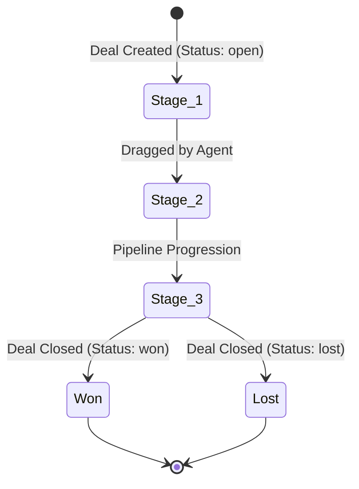
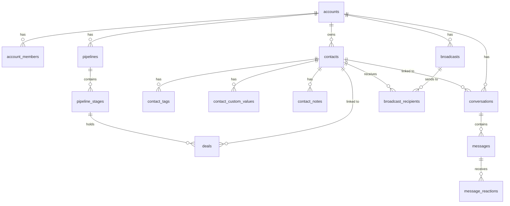

# Database Summary - SyncWA

This document provides a factual schema summary of the PostgreSQL database backing the SyncWA application, based on the repository's migration files under `supabase/migrations/`.

---

## 1. Core Data Models & Schema

### Workspace (Account) Model
* **Table:** `accounts` (introduced in migration 017)
* **Purpose:** Serves as the primary tenant container. Every piece of operational data (contacts, conversations, pipelines, automations, configurations) belongs to a single account.
* **Fields:**
  * `id` UUID (Primary Key)
  * `name` TEXT (Account or Company name)
  * `default_currency` TEXT (3-letter currency code, e.g., 'USD', CHECK constraint enforced)
  * `created_at` TIMESTAMPTZ
  * `updated_at` TIMESTAMPTZ

### User (Profile) Model
* **Table:** `profiles`
* **Purpose:** Maps user authentication metadata to workspace users.
* **Fields:**
  * `id` UUID (Primary Key)
  * `user_id` UUID (References Supabase's internal `auth.users(id)`)
  * `full_name` TEXT
  * `email` TEXT
  * `avatar_url` TEXT (Nullable, references public avatars bucket)
  * `created_at` TIMESTAMPTZ
  * `updated_at` TIMESTAMPTZ

### Membership Join Model
* **Table:** `account_members` (introduced in migration 017)
* **Purpose:** Maps users to accounts, establishing permission boundaries.
* **Fields:**
  * `id` UUID (Primary Key)
  * `account_id` UUID (References `accounts.id` ON DELETE CASCADE)
  * `user_id` UUID (References `auth.users(id)` ON DELETE CASCADE)
  * `role` TEXT (Enforced by CHECK constraints: `'owner'`, `'admin'`, `'agent'`, `'viewer'`)
  * `created_at` TIMESTAMPTZ
  * `updated_at` TIMESTAMPTZ
* **Constraints:** Unique index on `(account_id, user_id)` (one role per user per account).

### Contact Model
* **Table:** `contacts`
* **Purpose:** Stores customer directory entries.
* **Fields:**
  * `id` UUID (Primary Key)
  * `account_id` UUID (References `accounts.id`)
  * `user_id` UUID (References `auth.users(id)` - tracking creator)
  * `phone` TEXT (Raw phone number)
  * `phone_normalized` TEXT (Generated indexable E.164 phone string)
  * `name` TEXT
  * `email` TEXT
  * `company` TEXT
  * `avatar_url` TEXT
  * `created_at` TIMESTAMPTZ
  * `updated_at` TIMESTAMPTZ
* **Constraints:** Unique index on `(account_id, phone_normalized)` (prevents duplicate phone contacts inside a workspace).

---

## 2. Conversation & Messaging Schema

### Conversation Model
* **Table:** `conversations`
* **Purpose:** Represents a single unified messaging thread with a customer contact.
* **Fields:**
  * `id` UUID (Primary Key)
  * `account_id` UUID (References `accounts.id`)
  * `contact_id` UUID (References `contacts.id` ON DELETE CASCADE)
  * `user_id` UUID (References `auth.users(id)` - owner tracker)
  * `status` TEXT (CHECK constraint: `'open'`, `'pending'`, `'closed'`)
  * `assigned_agent_id` UUID (References `profiles.user_id` - assigned team agent)
  * `last_message_text` TEXT (Snippet of the last text message)
  * `last_message_at` TIMESTAMPTZ
  * `unread_count` INTEGER (Count of unread customer messages)
  * `ai_autoreply_disabled` BOOLEAN (Mutes the auto-reply bot)
  * `ai_reply_count` INTEGER (Counts replies sent by the bot for the current thread)
  * `ai_handoff_summary` TEXT (Summary note from LLM when handing off to human)
  * `created_at` TIMESTAMPTZ
  * `updated_at` TIMESTAMPTZ
* **Constraints:** Unique index on `(account_id, contact_id)` (one contact cannot have multiple threads).

### Message Model
* **Table:** `messages`
* **Purpose:** Records individual incoming and outgoing WhatsApp messages.
* **Fields:**
  * `id` UUID (Primary Key)
  * `account_id` UUID (References `accounts.id`)
  * `conversation_id` UUID (References `conversations.id` ON DELETE CASCADE)
  * `sender_type` TEXT (CHECK constraint: `'customer'`, `'agent'`, `'bot'`)
  * `sender_id` UUID (Nullable, references sender profile if sent by human agent)
  * `content_type` TEXT (CHECK: `'text'`, `'image'`, `'document'`, `'audio'`, `'video'`, `'location'`, `'template'`, `'interactive'`)
  * `content_text` TEXT (Message body text or caption)
  * `media_url` TEXT (Internal proxy URL to download attachments)
  * `template_name` TEXT (Name of the Meta template if applicable)
  * `message_id` TEXT (Meta's stable message ID string, e.g. `wamid...`)
  * `interactive_reply_id` TEXT (tapped button/row ID on an interactive message)
  * `reply_to_message_id` UUID (References `messages.id` - swipe replies)
  * `ai_generated` BOOLEAN (Set to TRUE if sent by the auto-reply bot)
  * `status` TEXT (CHECK: `'sending'`, `'sent'`, `'delivered'`, `'read'`, `'failed'`)
  * `created_at` TIMESTAMPTZ

### Message Reactions
* **Table:** `message_reactions`
* **Fields:**
  * `message_id` UUID (References `messages.id` ON DELETE CASCADE)
  * `conversation_id` UUID (References `conversations.id` ON DELETE CASCADE)
  * `actor_type` TEXT (CHECK: `'customer'`, `'agent'`)
  * `actor_id` UUID (FK to contact or user profile)
  * `emoji` TEXT (Emoji string)
  * `created_at` TIMESTAMPTZ
* **Constraints:** Composite Primary Key on `(message_id, actor_type, actor_id)`.

---

## 3. Lead Lifecycle & Pipeline Schema

### Pipelines
* **Table:** `pipelines`
* **Fields:** `id` UUID, `account_id` UUID, `name` TEXT, `created_at` TIMESTAMPTZ.

### Stages
* **Table:** `pipeline_stages`
* **Fields:** `id` UUID, `pipeline_id` UUID, `name` TEXT, `position` INTEGER (sorting index), `color` TEXT (hex code), `created_at` TIMESTAMPTZ.

### Deals
* **Table:** `deals`
* **Fields:**
  * `id` UUID (Primary Key)
  * `account_id` UUID (References `accounts.id`)
  * `pipeline_id` UUID (References `pipelines.id` ON DELETE CASCADE)
  * `stage_id` UUID (References `pipeline_stages.id` ON DELETE RESTRICT)
  * `contact_id` UUID (References `contacts.id` ON DELETE SET NULL - history preserved if contact is deleted)
  * `conversation_id` UUID (Nullable, references `conversations.id` ON DELETE SET NULL)
  * `title` TEXT
  * `value` NUMERIC(12,2)
  * `currency` TEXT (3-letter currency code, defaults to account currency)
  * `notes` TEXT
  * `expected_close_date` DATE
  * `status` TEXT (defaults to `'open'`, can progress to `'won'` or `'lost'`)
  * `created_at` TIMESTAMPTZ
  * `updated_at` TIMESTAMPTZ

---

## 4. Broadcast Campaigns Schema

### Broadcasts
* **Table:** `broadcasts`
* **Purpose:** Stores details and analytics for template campaigns.
* **Fields:**
  * `id` UUID, `account_id` UUID, `name` TEXT, `status` TEXT (`'draft'`, `'scheduled'`, `'sending'`, `'sent'`, `'failed'`)
  * `template_name` TEXT, `template_language` TEXT
  * `template_variables` JSONB, `audience_filter` JSONB, `scheduled_at` TIMESTAMPTZ
  * Aggregates: `total_recipients`, `sent_count`, `delivered_count`, `read_count`, `replied_count`, `failed_count`
  * Triggers automatically update parent counts as recipient statuses update.

### Broadcast Recipients
* **Table:** `broadcast_recipients`
* **Purpose:** Maps specific recipients.
* **Fields:**
  * `id` UUID, `broadcast_id` UUID, `contact_id` UUID (ON DELETE SET NULL)
  * `status` TEXT (`'pending'`, `'sent'`, `'delivered'`, `'read'`, `'replied'`, `'failed'`)
  * `sent_at`, `delivered_at`, `read_at`, `replied_at` TIMESTAMPTZ
  * `whatsapp_message_id` TEXT (Used to map incoming delivery webhooks from Meta)
  * `error_message` TEXT (Nullable error logs)

---

## 5. Relationships & Key Business Objects

